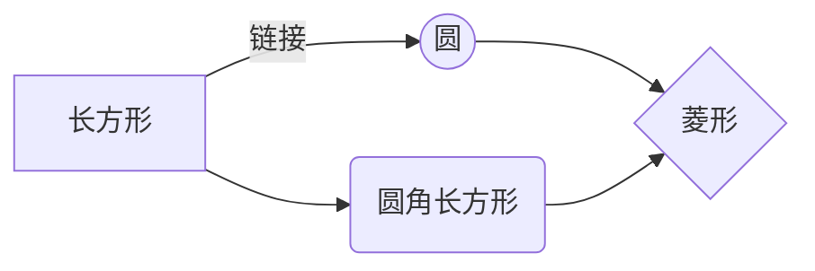

当公司系统主要基于Java时，强烈推荐基于Java的消息中间件，如RocketMQ, ActiveMQ，便于维护和扩展。当然，一些特别的场景得用特别的MQ，如kafka。
[RocketMQ吐血总结](https://github.com/javahongxi/whatsmars/tree/master/whatsmars-mq/whatsmars-mq-rocketmq)

```mermaid
graph LR
A[长方形] -- 链接 --> B((圆))
A --> C(圆角长方形)
B --> D{菱形}
C --> D
```

