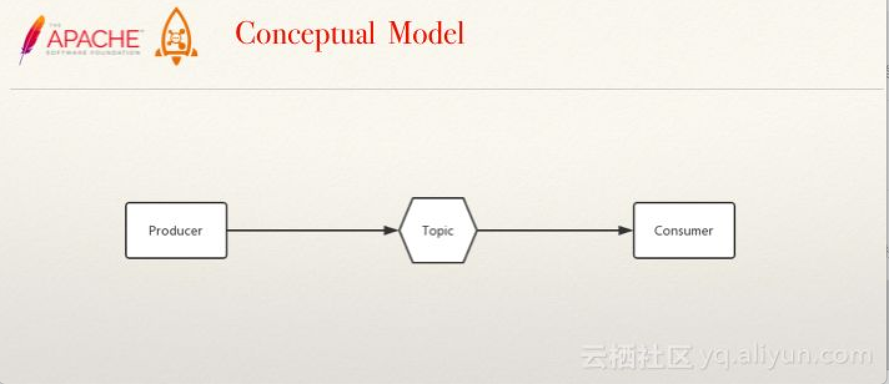
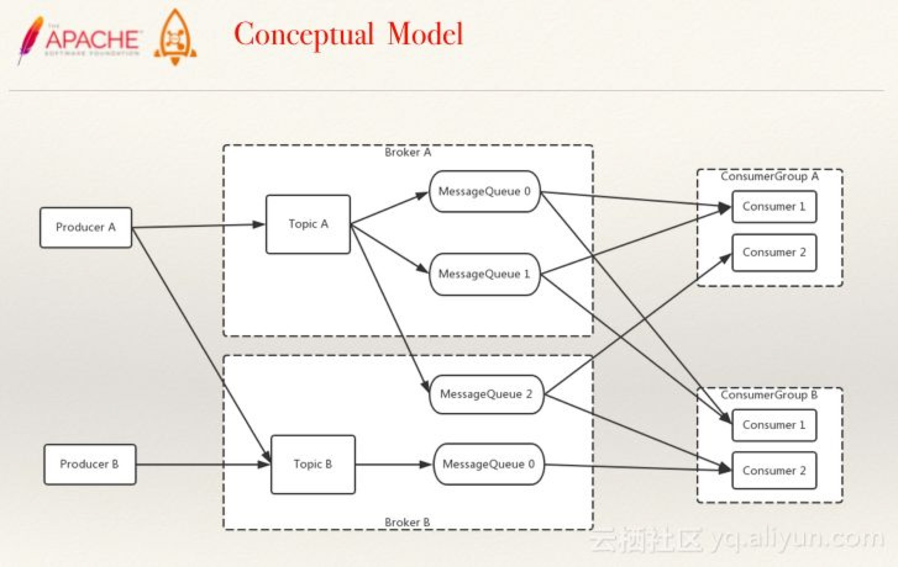
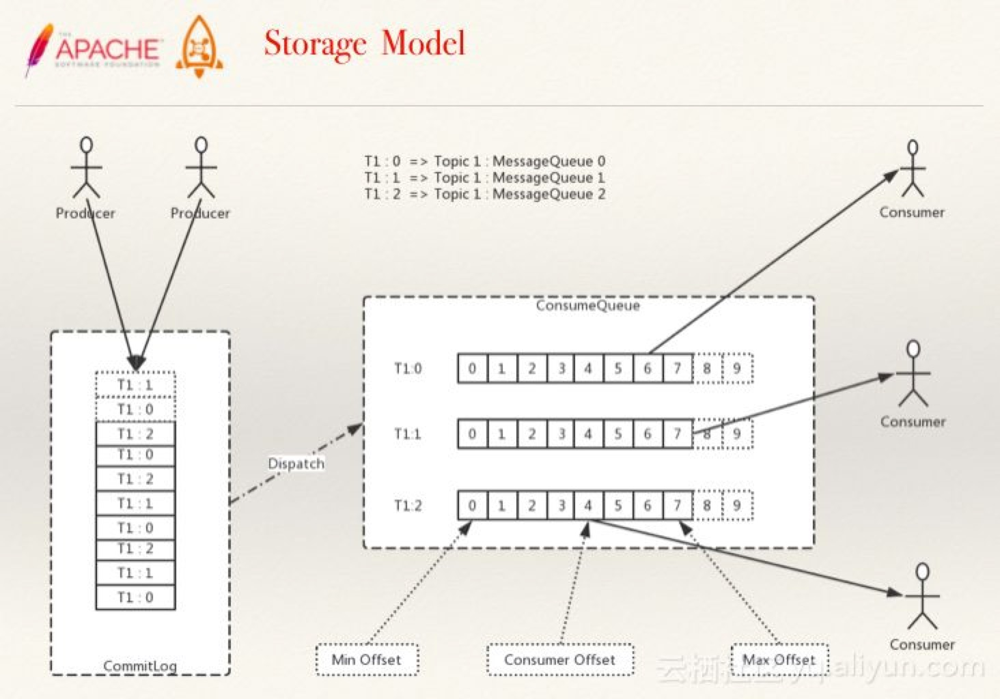

# [Apache RocketMQ](http://rocketmq.apache.org)
分布式消息中间件

### Quick Start
- .properties指定rocketmqHome,listenPort，启动NamesrvStartup (whatsmars-mq-rocketmq-namesrv)
- .properties指定rocketmqHome,namesrvAddr等，启动BrokerStartup (whatsmars-mq-rocketmq-broker)
- 依次启动Consumer,Producer (whatsmars-mq-rocketmq)
- 管理后台：https://github.com/apache/rocketmq-externals/tree/master/rocketmq-console
- 命令行管理工具MQAdmin: bin/mqadmin
- 脚本启动 https://github.com/apache/rocketmq/blob/master/distribution/bin/README.md
<br>download [rocketmq-all-4.3.1-bin-release.zip](http://rocketmq.apache.org/release_notes/release-notes-4.3.1)
```
> nohup sh bin/mqnamesrv &
> tail -f ~/logs/rocketmqlogs/namesrv.log
> nohup sh bin/mqbroker -c broker.properties -n localhost:9876 &
> tail -f ~/logs/rocketmqlogs/broker.log
> export NAMESRV_ADDR=localhost:9876
> sh bin/tools.sh org.apache.rocketmq.example.quickstart.Producer
SendResult [sendStatus=SEND_OK, msgId= ...
> sh bin/tools.sh org.apache.rocketmq.example.quickstart.Consumer
ConsumeMessageThread_%d Receive New Messages: [MessageExt...
```

### 架构


### 概念模型
最基本的概念模型与扩展后段概念模型



### 存储模型


### User Guide
- RocketMQ是一款分布式消息中间件，最初是由阿里巴巴消息中间件团队研发并大规模应用于生产系统，满足线上海量消息堆积的需求，
在2016年底捐赠给Apache开源基金会成为孵化项目，经过不到一年时间正式成为了Apache顶级项目；早期阿里曾经基于ActiveMQ研发消息系统，
随着业务消息的规模增大，瓶颈逐渐显现，后来也考虑过Kafka，但因为在低延迟和高可靠性方面没有选择，最后才自主研发了RocketMQ，
各方面的性能都比目前已有的消息队列要好，RocketMQ和Kafka在概念和原理上都非常相似，所以也经常被拿来对比；RocketMQ默认采用长轮询的拉模式，
单机支持千万级别的消息堆积，可以非常好的应用在海量消息系统中。
- NameServer可以部署多个，相互之间独立，其他角色同时向多个NameServer机器上报状态信息，从而达到热备份的目的。
NameServer本身是无状态的，也就是说NameServer中的Broker、Topic等状态信息不会持久存储，都是由各个角色定时上报并
存储到内存中的(NameServer支持配置参数的持久化，一般用不到)。
- 为何不用ZooKeeper？ZooKeeper的功能很强大，包括自动Master选举等，RocketMQ的架构设计决定了它不需要进行Master选举，
用不到这些复杂的功能，只需要一个轻量级的元数据服务器就足够了。值得注意的是，NameServer并没有提供类似Zookeeper的watcher机制，
而是采用了每30s心跳机制。
- 心跳机制
  + 单个Broker跟所有Namesrv保持心跳请求，心跳间隔为30秒，心跳请求中包括当前Broker所有的Topic信息。Namesrv会反查Broker的心跳信息，
  如果某个Broker在2分钟之内都没有心跳，则认为该Broker下线，调整Topic跟Broker的对应关系。但此时Namesrv不会主动通知Producer、Consumer有Broker宕机。
  + Consumer跟Broker是长连接，会每隔30秒发心跳信息到Broker。Broker端每10秒检查一次当前存活的Consumer，若发现某个Consumer 2分钟内没有心跳，
  就断开与该Consumer的连接，并且向该消费组的其他实例发送通知，触发该消费者集群的负载均衡(rebalance)。
  + 生产者每30秒从Namesrv获取Topic跟Broker的映射关系，更新到本地内存中。再跟Topic涉及的所有Broker建立长连接，每隔30秒发一次心跳。
  在Broker端也会每10秒扫描一次当前注册的Producer，如果发现某个Producer超过2分钟都没有发心跳，则断开连接。
- Namesrv压力不会太大，平时主要开销是在维持心跳和提供Topic-Broker的关系数据。但有一点需要注意，Broker向Namesrv发心跳时，
会带上当前自己所负责的所有Topic信息，如果Topic个数太多（万级别），会导致一次心跳中，就Topic的数据就几十M，网络情况差的话，
网络传输失败，心跳失败，导致Namesrv误认为Broker心跳失败。
- 每个主题可设置队列个数，自动创建主题时默认4个，需要顺序消费的消息发往同一队列，比如同一订单号相关的几条需要顺序消费的消息发往同一队列，
顺序消费的特点的是，不会有两个消费者共同消费任一队列，且当消费者数量小于队列数时，消费者会消费多个队列。至于消息重复，在消
费端处理。RocketMQ 4.3+支持事务消息，可用于分布式事务场景(最终一致性)。
- 关于queueNums:
  + 客户端自动创建，Math.min算法决定最多只会创建8个(BrokerConfig)队列，若要超过8个，可通过控制台创建/修改，Topic配置保存在store/config/topics.json
  + 消费负载均衡的最小粒度是队列，Consumer的数量应不大于队列数
  + 读写队列数(writeQueueNums/readQueueNums)是RocketMQ特有的概念，可通过console修改。当readQueueNums不等于writeQueueNums时，会有什么影响呢？
```java
topicRouteData = this.mQClientAPIImpl.getDefaultTopicRouteInfoFromNameServer(defaultMQProducer.getCreateTopicKey(), 1000 * 3);
    if (topicRouteData != null) {
        for (QueueData data : topicRouteData.getQueueDatas()) {
            int queueNums = Math.min(defaultMQProducer.getDefaultTopicQueueNums(), data.getReadQueueNums());
            data.setReadQueueNums(queueNums);
            data.setWriteQueueNums(queueNums);
        }
    }
```
- Broker上存Topic信息，Topic由多个队列组成，队列会平均分散在多个Broker上。Producer的发送机制保证消息尽量平均分布到
所有队列中，最终效果就是所有消息都平均落在每个Broker上。
- RocketMQ的消息的存储是由ConsumeQueue和CommitLog配合来完成的，ConsumeQueue中只存储很少的数据，消息主体都是通过CommitLog来进行读写。
如果某个消息只在CommitLog中有数据，而ConsumeQueue中没有，则消费者无法消费。
  + CommitLog：是消息主体以及元数据的存储主体，对CommitLog建立一个ConsumeQueue，每个ConsumeQueue对应一个（概念模型中的）MessageQueue，所以只要有
  CommitLog在，ConsumeQueue即使数据丢失，仍然可以恢复出来。
  + ConsumeQueue：是一个消息的逻辑队列，存储了这个Queue在CommitLog中的起始offset，log大小和MessageTag的hashCode。每个Topic下的每个Queue都有一个对应的
  ConsumeQueue文件，例如Topic中有三个队列，每个队列中的消息索引都会有一个编号，编号从0开始，往上递增。并由此一个位点offset的概念，有了这个概念，就可以对
  Consumer端的消费情况进行队列定义。
- RocketMQ的高性能在于顺序写盘(CommitLog)、零拷贝和跳跃读(尽量命中PageCache)，高可靠性在于刷盘和Master/Slave，另外NameServer
全部挂掉不影响已经运行的Broker,Producer,Consumer。
- 发送消息负载均衡，且发送消息线程安全(可满足多个实例死循环发消息)，集群消费模式下消费者端负载均衡，这些特性加上上述的高性能读写，
共同造就了RocketMQ的高并发读写能力。
- 刷盘和主从同步均为异步(默认)时，broker进程挂掉(例如重启)，消息依然不会丢失，因为broker shutdown时会执行persist。
当物理机器宕机时，才有消息丢失的风险。另外，master挂掉后，消费者从slave消费消息，但slave不能写消息。
- RocketMQ具有很好动态伸缩能力(非顺序消息)，伸缩性体现在Topic和Broker两个维度。
  + Topic维度：假如一个Topic的消息量特别大，但集群水位压力还是很低，就可以扩大该Topic的队列数，Topic的队列数跟发送、消费速度成正比。
  + Broker维度：如果集群水位很高了，需要扩容，直接加机器部署Broker就可以。Broker起来后向Namesrv注册，Producer、Consumer通过Namesrv
  发现新Broker，立即跟该Broker直连，收发消息。
- Producer: 失败默认重试2次；sync/async；ProducerGroup，在事务消息机制中，如果发送消息的producer在还未commit/rollback前挂掉了，
broker会在一段时间后回查ProducerGroup里的其他实例，确认消息应该commit/rollback
- Consumer: DefaultPushConsumer/DefaultPullConsumer，push也是用pull实现的，采用的是长轮询方式；CLUSTERING模式下，一条消息只会被ConsumerGroup
里的一个实例消费，但可以被多个不同的ConsumerGroup消费，BROADCASTING模式下，一条消息会被ConsumerGroup里的所有实例消费。
- DefaultPushConsumer: Broker收到新消息请求后，如果队列里没有新消息，并不急于返回，通过一个循环不断查看状态，每次waitForRunning一段时间(5s)，然后在check。
当一直没有新消息，第三次check时，等待时间超过suspendMaxTimeMills(15s)，就返回空结果。在等待的过程中，Broker收到了新的消息后会直接调用notifyMessageArriving
返回请求结果。“长轮询”的核心是，Broker端Hold住(挂起)客户端客户端过来的请求一小段时间，在这个时间内有新消息到达，就利用现有的连接立刻返回消息给Consumer。“长轮询”
的主动权还是掌握在Consumer手中，Broker即使有大量消息积压，也不会主动推送给Consumer。长轮询方式的局限性，是在Hold住Consumer请求的时候需要占用资源，它适合用在
消息队列这种客户端连接数可控的场景中。
- DefaultPullConsumer: 需要用户自己处理遍历MessageQueue、保存Offset，所以PullConsumer有更多的自主性和灵活性。
- 对于集群模式的非顺序消息，消费失败默认重试16次，延迟等级为3~18。(messageDelayLevel = "1s 5s 10s 30s 1m 2m 3m 4m 5m 6m 7m 8m 9m 10m 20m 30m 1h 2h")
- MQClientInstance是客户端各种类型的Consumer和Producer的底层类，由它与NameServer和Broker打交道。如果创建Consumer或Producer
类型的时候不手动指定instanceName，进程中只会有一个MQClientInstance对象，即当一个Java程序需要连接多个MQ集群时，必须手动指定不同的instanceName。
需要一提的是，当消费者(不同jvm实例)都在同一台物理机上时，若指定instanceName，消费负载均衡将失效(每个实例都将消费所有消息)。
另外，在一个jvm里模拟集群消费时，必须指定不同的instanceName，否则启动时会提示ConsumerGroup已存在。

### RocketMQ Remoting
see remoting.md

### Q&A
#### Q1：分布式消息系统中，如何避免消息重复？

造成消息重复的根本原因是：网络不可靠。只要通过网络交换数据，就无法避免这个问题。所以解决这个问题的办法就是绕过这个问题。
那么问题就变成了：如果消费端收到两条一样的消息，应该怎样处理？

- 消费端处理消息的业务逻辑保持幂等性;
- 保证每条消息都有唯一编号且保证消息处理成功与去重表的日志同时出现。

通过幂等性，不管来多少条重复消息，可以实现处理的结果都一样。再利用一张日志表来记录已经处理成功的消息的ID，如果新到的消息ID已经在日志表中，
那么就可以不再处理这条消息，避免消息的重复处理。

#### Q2：顺序消息扩容的过程中，如何在不停写的情况下保证消息顺序？
1. 成倍扩容，实现扩容前后，同样的key，hash到原队列，或者hash到新扩容的队列；

1. 扩容前，记录旧队列中的最大位点；

1. 对于每个Consumer Group，保证旧队列中的数据消费完，再消费新队列，也即：先对新队列进行禁读即可；

#### Q3：分布式消息系统中，如何对消息进行重放？

消费位点就是一个数字，把Consumer Offset改一下就可以达到重放的目的了。

### More
- [源码研究RocketMQ](https://blog.csdn.net/prestigeding/column/info/20603)
- [《RocketMQ技术内幕：RocketMQ架构设计与实现原理》](https://e.jd.com/30446645.html) `e.jd.com`
- [RocketMQ VS kafka](https://github.com/javahongxi/whatsmars/wiki/RocketMQ-VS-kafka)
