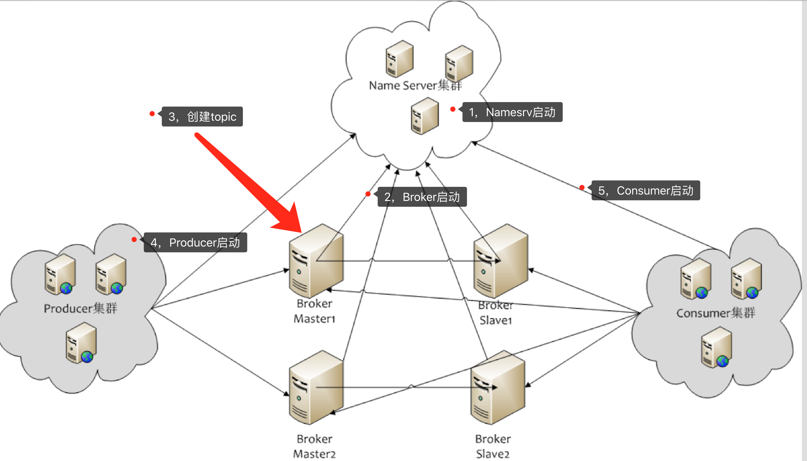

# [Apache RocketMQ](https://github.com/apache/rocketmq)
分布式消息中间件

### Test
- .properties指定rocketmqHome,namesrvAddr等，依次启动NamesrvStartup,BrokerStartup
(whatsmars-mq-rocketmq-namesrv, whatsmars-mq-rocketmq-broker)
- 依次启动Consumer,Producer
- 管理后台：https://github.com/apache/rocketmq-externals/tree/master/rocketmq-console
- 命令行管理工具MQAdmin: bin/mqadmin

### 架构

### User Guide
- NameServer可以部署多个，相互之间独立，其他角色同时向多个NameServer机器上报状态信息，从而达到热备份的目的。
NameServer本身是无状态的，也就是说NameServer中的Broker、Topic等状态信息不会持久存储，都是由各个角色定时上报并
存储到内存中的(NameServer支持配置参数的持久化，一般用不到)。
- 为何不用ZooKeeper？ZooKeeper的功能很强大，包括自动Master选举等，RocketMQ的架构设计决定了它不需要进行Master选举，
用不到这些复杂的功能，只需要一个轻量级的元数据服务器就足够了。值得注意的是，NameServer并没有提供类似Zookeeper的watcher机制，
而是采用了每30s心跳机制。
- 心跳机制
  + 单个Broker跟所有Namesrv保持心跳请求，心跳间隔为30秒，心跳请求中包括当前Broker所有的Topic信息。Namesrv会反查Broer的心跳信息，
  如果某个Broker在2分钟之内都没有心跳，则认为该Broker下线，调整Topic跟Broker的对应关系。但此时Namesrv不会主动通知Producer、Consumer有Broker宕机。
  + Consumer跟Broker是长连接，会每隔30秒发心跳信息到Broker。Broker端每10秒检查一次当前存活的Consumer，若发现某个Consumer 2分钟内没有心跳，
  就断开与该Consumer的连接，并且向该消费组的其他实例发送通知，触发该消费者集群的负载均衡(rebalance)。
  + 生产者每30秒从Namesrv获取Topic跟Broker的映射关系，更新到本地内存中。再跟Topic涉及的所有Broker建立长连接，每隔30秒发一次心跳。
  在Broker端也会每10秒扫描一次当前注册的Producer，如果发现某个Producer超过2分钟都没有发心跳，则断开连接。
- Namesrv压力不会太大，平时主要开销是在维持心跳和提供Topic-Broker的关系数据。但有一点需要注意，Broker向Namesrv发心跳时，
会带上当前自己所负责的所有Topic信息，如果Topic个数太多（万级别），会导致一次心跳中，就Topic的数据就几十M，网络情况差的话，
网络传输失败，心跳失败，导致Namesrv误认为Broker心跳失败。
- 每个主题可设置队列个数，默认4个，需要顺序消费的消息发往同一队列，比如同一订单号相关的几条需要顺序消费的消息发往同一队列，
顺序消费的特点的是，不会有两个消费者共同消费任一队列，且当消费者数量小于队列数时，消费者会消费多个队列。至于消息重复，在消
费端处理。RocketMQ 4.3+支持事务消息，可用于分布式事务场景。
- Broker上存Topic信息，Topic由多个队列组成，队列会平均分散在多个Broker上。Producer的发送机制保证消息尽量平均分布到
所有队列中，最终效果就是所有消息都平均落在每个Broker上。Consumer的个数应不大于队列数。
- CommitLog是存储消息元数据的文件，所有topic的消息统一保存，达到上限后新建，会定期清理。ConsumerQueue相当于CommitLog的索引文件，
消费者消费时会先从ConsumerQueue中查找消息在commitLog中的offset，再去CommitLog中找元数据。如果某个消息只在CommitLog中有数据，
没在ConsumerQueue中，则消费者无法消费，RocketMQ的事务消息实现就利用了这一点。
- RocketMQ的高性能在于顺序写盘(CommitLog)、零拷贝和跳跃读(尽量命中PageCache)，高可靠性在于刷盘和Master/Slave，另外NameServer
全部挂掉不影响已经运行的Broker,Producer,Consumer。
- 发送消息负载均衡，且发送消息线程安全(可满足多个实例死循环发消息)，集群消费模式下消费者端负载均衡，这些特性加上上述的高性能读写，
共同造就了RocketMQ的高并发读写能力。
- 刷盘和主从同步均为异步(默认)时，broker进程挂掉(例如重启)，消息依然不会丢失，应该是 shutdown hook之类的机制促发刷盘。
当物理机器宕机时，才有消息丢失的风险。另外，master挂掉后，消费者从slave消费消息，但slave不能写消息。
- RocketMQ具有很好动态伸缩能力(非顺序消息)，伸缩性体现在Topic和Broker两个维度。
  + Topic维度：假如一个Topic的消息量特别大，但集群水位压力还是很低，就可以扩大该Topic的队列数，Topic的队列数跟发送、消费速度成正比。
  + Broker维度：如果集群水位很高了，需要扩容，直接加机器部署Broker就可以。Broker起来后向Namesrv注册，Producer、Consumer通过Namesrv
  发现新Broker，立即跟该Broker直连，收发消息。
- Producer: 失败默认重试2次，sync/async
- Consumer: DefaultPushConsumer/DefaultPullConsumer，push也是用pull实现的，如用纯push实现，broker无法知道消费端的消费能力是个问题
- MQClientInstance是客户端各种类型的Consumer和Producer的底层类，由它与NameServer和Broker打交道。如果创建Consumer或Producer
类型的时候不手动指定InstanceName，进程中只会有一个MQClientInstance对象，即当一个Java程序需要连接多个MQ集群时，必须手动指定不同的InstanceName。

### More
- [RocketMQ架构模块解析](https://blog.csdn.net/javahongxi/article/details/72956608)
- [RocketMQ高并发读写](https://blog.csdn.net/javahongxi/article/details/72956619)
- [《RocketMQ实战与原理解析》](https://book.douban.com/subject/30246992/) `douban.com`