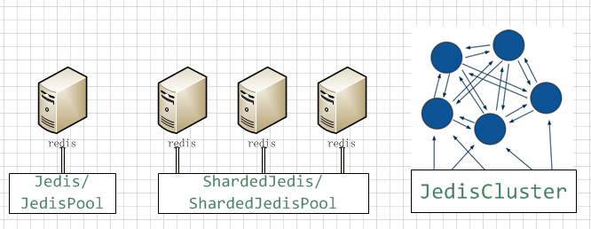

# [Redis](https://github.com/antirez/redis)
Redis is an in-memory database that persists on disk. The data model is key-value,
but many different kind of values are supported: Strings, Lists, Sets, Sorted Sets,
Hashes, HyperLogLogs, Bitmaps. https://redis.io http://redis.net.cn

### Jedis连接方式

### 基于M-S模式下读写分离
通常情况下，Slave只是作为数据备份，不提供read操作，这种考虑是为了避免slave提供stale数据而导致一些问题。
不过在很多场景下，即使slave数据有一定的延迟，我们仍然可以兼容或者正常处理，此时我们可以将slave提供read
服务，并在M-S集群中将read操作分流，此时我们的Redis集群将可以支撑更高的QPS。本实例中，仅仅提供了“读写分
离”的样板，尚未对所有的redis方法进行重写和封装，请开发者后续继续补充即可。此外，slave节点如果异常，我们
应该支持failover，这一部分特性后续再扩展。

### Spring Data Redis
- Spring Data’s mission is to provide a familiar and consistent, Spring-based programming model
for data access while still retaining the special traits of the underlying data store.
- SDR对Redis的标准模式和Cluster模式进行了充分封装，但并未对客户端sharding进行良好封装，需要开发者自己实现，
这也是SDR和Jedis相比，唯一缺少的特性。另外，Redis官网给出了一个Redis的Java客户端列表，SDR支持Jedis,
Lettuce ['lɛtɪs]，Spring Boot 2.x默认使用Lettuce。
- 早期Redis还没有Cluster特性，所以较早出现的Redis的Java客户端或Proxy大都自己实现了分片和集群功能，相比客户端分片，
SDR显然更提倡Cluster模式
- Jedis实例是线程不安全的，在多线程的环境下，需要使用连接池，每个线程都使用自己的Jedis实例，当连接数增多时，
会消耗较多的物理资源。而Lettuce基于Netty，是一个可伸缩的线程安全的Redis客户端，支持同步、异步和响应式模式。

### MORE
- [如何根据key前缀统计内存占用](https://segmentfault.com/q/1010000010575235)